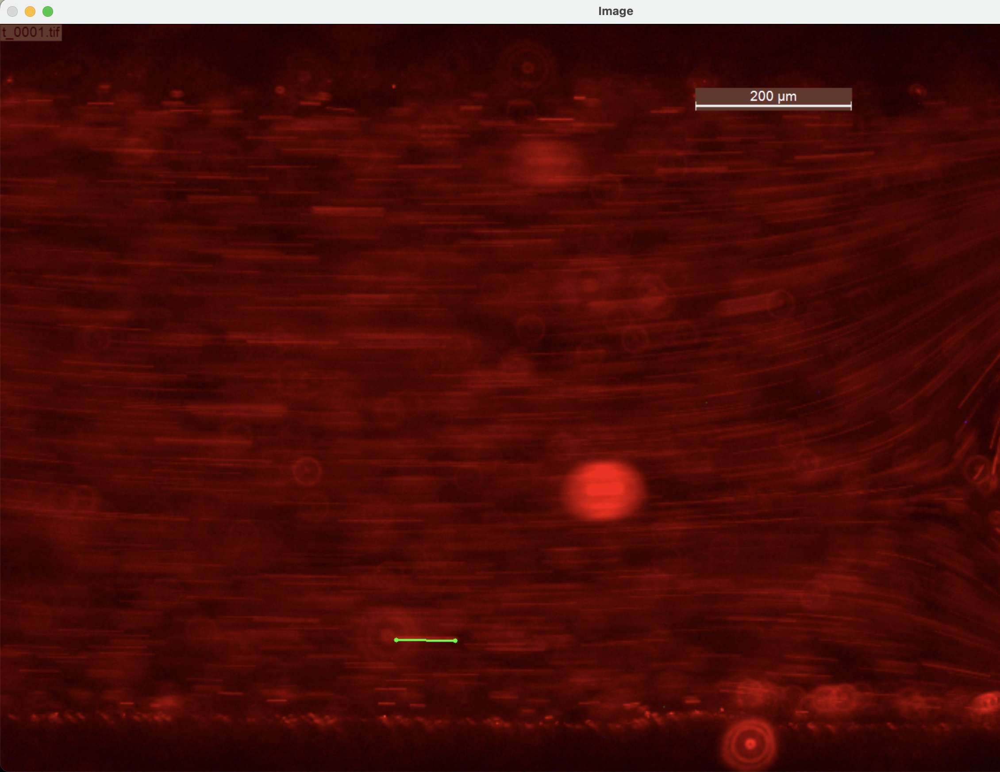

# AER210-Image-Analysis

1. To setup the environment, please run `pip install opencv-python` and `pip install numpy`
2. Once the environment is setup, run `python length.py` in the terminal
3. Click the two endpoints of the line you want to measure and then press enter after the line shows up
4. The length of the line would show up in the terminal as we intended

